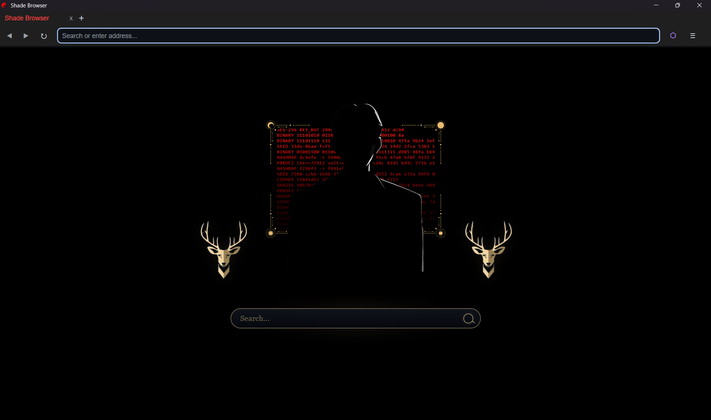
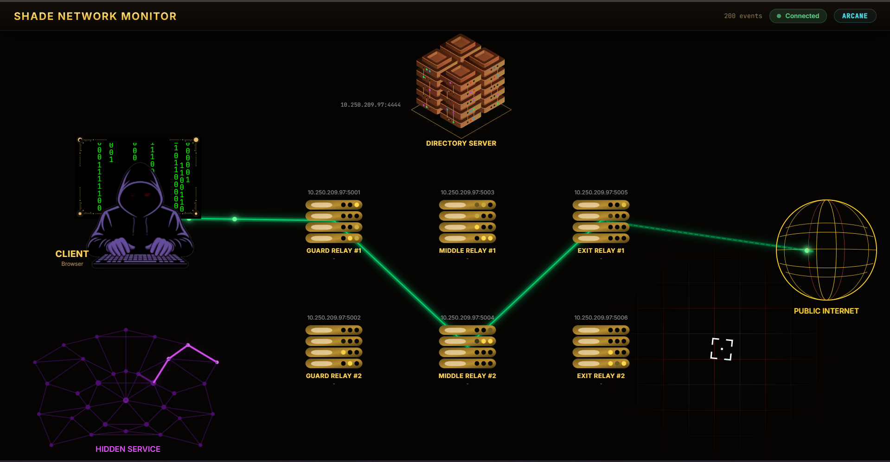
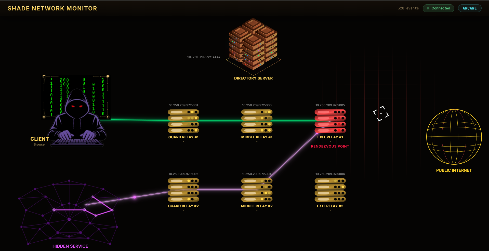

<p align="center">
  
</p>

<h1 align="center">Shade Network</h1>

<p align="center">
  <b>A custom overlay networking stack for anonymous business ecosystem inspired by Tor's onion routing.</b>
</p>

<p align="center">
  <code>C++ 17</code> · <code>Docker</code> · <code>Distributed Systems</code> · <code>Networking</code> · <code>System Programming</code>· <code>Protocol Design</code>· <code>Cryptography</code>
</p>

---

## Overview

Shade is a **fully functional anonymous communication network** built from scratch in C++. It implements multi-hop onion routing, hidden services (`.shade` TLD), a custom binary protocol and a purpose-built browser — all orchestrated via Docker Compose.

> **This is not a wrapper around Tor.** Every component — from the relay cell protocol to the key exchange, from the directory authority to the browser's scheme handler — is a ground-up implementation.

---
## Demo

[](https://youtu.be/4KWWBAw61rk)

**▶️ [Watch the full Shade Network demo on YouTube](https://youtu.be/4KWWBAw61rk)**

## Screenshots

### Shade Browser

<p align="center">
  
</p>

### Network Monitoring Dashboard

<p align="center">
  
</p>

<p align="center">
  
</p>

## Components

| Component | Language | Description |
|-----------|----------|-------------|
| **`browser/`** | C++ | Custom browser built on Chromium Embedded Framework (CEF) with built-in SOCKS5 proxy, `aphelion://` scheme handler, and `.shade` domain resolution |
| **`relay/`** | C++ | Onion relay node — operates as Guard, Middle, or Exit. Handles circuit creation, cell forwarding, stream multiplexing, and introduction/rendezvous point duties |
| **`directory/`** | C++ | Directory Authority — central registry for relay discovery, `.shade` domain mapping, and encrypted HS descriptor storage |
| **`server/`** | C++ | Hidden Service engine — establishes introduction points, handles rendezvous, and forwards decrypted traffic to a local application server |
| **`common/`** | C++ | Shared library — cryptographic primitives, protocol definitions, cell I/O, Aphelion framing, and logging |
| **`blockchain/`** | C++ | Arcane blockchain node — PoA-based cryptocurrency with JSON-RPC API for the market |
| **`market/`** | Node.js | Darknet marketplace web application served over `.shade` hidden service |
| **`monitoring/`** | React + Node.js | Real-time network topology dashboard with circuit visualization |
| **`container/`** | Docker | Docker Compose orchestration, Dockerfiles, entrypoint scripts, and `launch.bat` |

---

## Cryptography

| Primitive | Algorithm | Usage |
|-----------|-----------|-------|
| Key Exchange | **X25519** (Curve25519) | Per-hop session key negotiation during circuit creation |
| Symmetric Encryption | **AES-256-GCM** | Onion encryption/decryption of cell payloads (12-byte IV, 16-byte auth tag) |
| Key Derivation | **HKDF-SHA256** | Deriving forward/backward AES keys from DH shared secret |
| Digital Signatures | **Ed25519** | Relay identity verification, HS descriptor signing |
| Key Ratcheting | **HKDF chain** | Forward secrecy within circuits — keys rotate every 100 cells |
| HS Descriptor Encryption | **AES-256-GCM** with `SHA256(domain)` as key | Directory stores encrypted descriptors it cannot read |

### Forward Secrecy via Key Ratcheting

Unlike Tor (which uses fixed keys per circuit), Shade ratchets symmetric keys every **100 cells** using HKDF:

```
Cell #1–100:   encrypt with K₀
Cell #101–200: K₁ = HKDF(K₀, "shade-ratchet-gen-1")  →  K₀ destroyed
Cell #201–300: K₂ = HKDF(K₁, "shade-ratchet-gen-2")  →  K₁ destroyed
```

HKDF is a one-way function — compromising K₂ cannot recover K₁ or K₀, providing forward secrecy **within** a circuit's lifetime.

---

## Circuit Building

Every connection uses a **3-hop circuit** (Guard → Middle → Exit):

```
1. Client → Guard:   CREATE cell with X25519 ephemeral public key
   Guard  → Client:  CREATED cell with relay's X25519 public key
   Both:             HKDF(DH_shared_secret) → forward_key + backward_key

2. Client → Guard:   RELAY cell containing EXTEND to Middle
   Guard  → Middle:  CREATE cell (new DH handshake)
   Middle → Guard:   CREATED
   Guard  → Client:  RELAY(EXTENDED) with Middle's key

3. Client → Middle:  RELAY cell containing EXTEND to Exit (double-encrypted)
   Middle → Exit:    CREATE cell (new DH handshake)
   Exit   → Client:  RELAY(EXTENDED) through both hops
```

After circuit creation, each hop only knows its immediate neighbors — **no single relay knows both the source and destination**.

---

## Hidden Services (.shade)

### How .shade Sites Work

```
  ┌─── HS SETUP ───────────────────────────────────────────────────────────────┐
  │  1. HS generates Ed25519 + X25519 key pairs                                │
  │  2. HS registers domain name → public key with Directory                   │
  │  3. HS builds 3-hop circuits to 2 relays, sends ESTABLISH_INTRO            │
  │  4. HS encrypts descriptor (intro points + keys) with SHA256(domain)       │
  │  5. HS uploads encrypted descriptor to Directory (opaque blob)             │
  └────────────────────────────────────────────────────────────────────────────┘

  ┌─── CLIENT CONNECTION ──────────────────────────────────────────────────────┐
  │  1. Client fetches encrypted descriptor from Directory                     │
  │  2. Client decrypts with SHA256("abc123.shade") → learns intro points      │
  │  3. Client picks random relay as Rendezvous Point (RP)                     │
  │  4. Client builds 3-hop circuit to RP, sends ESTABLISH_RENDEZVOUS(cookie)  │
  │  5. Client builds 3-hop circuit to Intro Point, sends INTRODUCE1           │
  │     containing: RP address + cookie + client X25519 key (encrypted)        │
  │  6. Intro Point forwards INTRODUCE2 to HS through HS's circuit             │
  │  7. HS decrypts, learns RP address + cookie + client key                   │
  │  8. HS builds 3-hop circuit to RP, sends RENDEZVOUS1(cookie, HS key)       │
  │  9. RP matches cookies, splices the two circuits                           │
  │  10. Client and HS derive shared e2e key from X25519 exchange              │
  │  11. Data flows: Client ←→ 3 hops ←→ RP ←→ 3 hops ←→ HS (6 hops total)     │
  └────────────────────────────────────────────────────────────────────────────┘
```

**Privacy properties:**
- The Directory cannot read HS descriptors (encrypted)
- Introduction Points don't know the `.shade` domain (only see HS identity key)
- The Rendezvous Point cannot read data content (end-to-end encrypted)
- No single node knows both the client's IP and the HS's IP

---

## DNS Resolution

DNS resolution happens **at the Exit node**, not the client. The client sends the raw hostname (e.g., `example.com:80`) inside a `RELAY_BEGIN` cell. The exit relay calls `getaddrinfo()` to resolve it, preventing DNS leaks at the client's ISP.

---

## Network Resilience

| Mechanism | Value | Purpose |
|-----------|-------|---------|
| Circuit timeout | 120s | Fast detection of dead circuits |
| Padding interval | 30s | PADDING cells keep circuits alive and detect dead relays |
| TCP keepalive | 30s idle, 10s probe, 3 retries | OS-level dead peer detection (~60s) |
| Relay heartbeat | 30s | Relays re-register with Directory |
| Stale relay cleanup | 90s | Directory prunes unresponsive relays |
| Client blacklisting | 5 min | Failed relays are avoided for circuit building |
| Max circuit retries | 3 | Client rebuilds circuits up to 3 times on failure |

---

## Monitoring Dashboard

Real-time network topology visualization accessible at `http://MASTER_IP:3001`:

- **Live circuit visualization** — animated packet flow through 3-hop paths
- **Dynamic relay addresses** — auto-discovered from relay heartbeat events
- **Hidden service circuit tracking** — separate visualization for `.shade` circuits with rendezvous point highlighting
- **Blockchain status** — live block height, peer count via RPC proxy
- **WebSocket streaming** — C++ components POST events to the dashboard backend, which streams them to the browser via WebSocket

---

## Quick Start

### Prerequisites

- **Docker Desktop** (Windows/macOS) or **Docker Engine + Compose** (Linux)
- **CMake 3.16+** and a C++17 compiler (only for browser builds)
- **CEF binaries** (only for browser builds)

### Single Machine (All Services)

```bash
cd container
docker compose up --build
```

This starts: Directory, 6 relays (2 Guard + 2 Middle + 2 Exit), Arcane blockchain node, Market, Hidden Service, and Monitoring Dashboard.

### Using launch.bat (Windows)

```
container\launch.bat
```

Interactive menu options:

| Option | Description |
|--------|-------------|
| **[1]** | Start all services |
| **[2]** | Start relays only |
| **[3]** | Start directory + blockchain |
| **[4]** | Start hidden service + market |
| **[5]** | Start monitoring dashboard |
| **[6]** | Auto-detect and set network IP |
| **[7]** | Set market wallet address |

### Multi-Machine Setup

1. **Master laptop** (runs Directory + Blockchain):
   ```
   launch.bat → Option [6] to auto-detect IP → Option [3]
   ```
2. **Copy `.env`** to other laptops (USB, network share)
3. **Relay laptops:**
   ```
   launch.bat → Option [2]
   ```
4. **Hidden Service laptop:**
   ```
   launch.bat → Option [4]
   ```

---

## Configuration

All configuration is done via `container/.env`:

| Variable | Default | Description |
|----------|---------|-------------|
| `MASTER_IP` | — | IP of the machine running the Directory server |
| `LOCAL_IP` | — | IP of the current machine (for relay advertisement) |
| `DIRECTORY_PORT` | `4444` | Directory Authority listen port |
| `ARCANE_PORT` | `6666` | Blockchain P2P port |
| `ARCANE_RPC_PORT` | `6667` | Blockchain JSON-RPC port |
| `MONITORING_PORT` | `3001` | Dashboard web UI port |
| `MARKET_PORT` | `3333` | Market file server port |

Relay ports are fixed per relay: `5001`–`5006` (2 Guard + 2 Middle + 2 Exit).

---

## Project Structure

```
shade/
├── browser/              # Chromium-based browser (CEF)
│   ├── net/              #   SOCKS5 proxy, shade_client, circuit management
│   ├── ui/               #   HTML/CSS/JS for browser chrome
│   └── build_cef/        #   CMake build for CEF integration
├── relay/                # Onion relay node
│   └── src/              #   Relay.cpp — circuit handling, cell forwarding,
│                         #   intro/rendezvous point logic, BACKFLOW
├── directory/            # Directory Authority
│   └── src/              #   DirectoryServer.cpp, ShadeResolver, RelayRegistry
├── server/               # Hidden Service engine
│   └── src/              #   ShadeService.cpp — intro points, descriptors,
│                         #   rendezvous, circuit building
├── common/               # Shared C++ library
│   └── src/              #   Crypto.h/cpp — X25519, AES-GCM, Ed25519, HKDF, ratcheting
│                         #   Protocol.h/cpp — cell types, relay roles, API endpoints
│                         #   OnionCell.h/cpp — 512-byte cell serialization
│                         #   AphelionRequest/Response — binary protocol framing
│                         #   CellIO, Logger, ThreadPool, DashboardEvents
├── blockchain/           # Arcane cryptocurrency
│   └── src/              #   Blockchain node + wallet CLI
├── market/               # Darknet marketplace (Node.js)
│   ├── app.js            #   Express server with Arcane integration
│   ├── public/           #   Frontend assets
│   └── wallet.txt        #   Market's Arcane wallet address
├── monitoring/           # Network dashboard
│   ├── frontend/         #   React app — topology SVG, circuit overlay
│   └── backend/          #   Express + WebSocket event server
└── container/            # Docker orchestration
    ├── docker-compose.yml
    ├── Dockerfile         #   Multi-stage build (C++ → runtime)
    ├── .env               #   Network configuration
    └── launch.bat         #   Windows interactive launcher
```

---

## Differences from Tor

| Feature | Tor | Shade |
|---------|-----|-------|
| Language | C | C++17 |
| Cell size | 514 bytes | 512 bytes |
| Cell magic | None | `SHAD` (4 bytes) |
| Key exchange | ntor (Curve25519 + HMAC) | X25519 + HKDF-SHA256 |
| Forward secrecy | Circuit rotation (~10 min) | In-circuit key ratcheting (every 100 cells) |
| Hidden service address | Base32 of public key (56 chars) | Registry-based short identifiers (`.shade`) |
| HS descriptor storage | Distributed (HSDir nodes) | Centralized Directory (encrypted blob) |
| HS registration | Self-authenticating (address = key) | Explicit registration (domain → key mapping) |
| Application protocol | HTTP | Aphelion (binary) |
| Directory communication | HTTP consensus documents | Aphelion binary protocol |
| Integrated cryptocurrency | No | Yes (Arcane, PoW-based) |

---

## Security Model

### What Shade protects against:
- **Network surveillance** — Multi-hop encryption prevents any single observer from linking source to destination
- **Traffic analysis** — Fixed 512-byte cells with PADDING prevent packet size fingerprinting
- **Replay attacks** — AES-GCM authenticated encryption with unique IVs
- **Key compromise (past traffic)** — Forward secrecy via key ratcheting
- **HS location discovery** — Hidden services communicate through circuits; the Directory cannot see intro points

### Limitations (by design — educational project):
- **Single Directory Authority** — a centralized point of trust (Tor uses 9+ distributed authorities)
- **No guard pinning** — clients don't persist guard relay selection across sessions
- **No bandwidth-weighted selection** — relays are chosen randomly, not weighted by capacity
